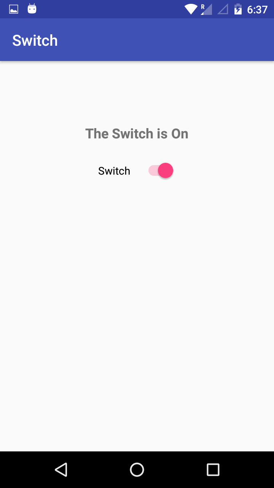
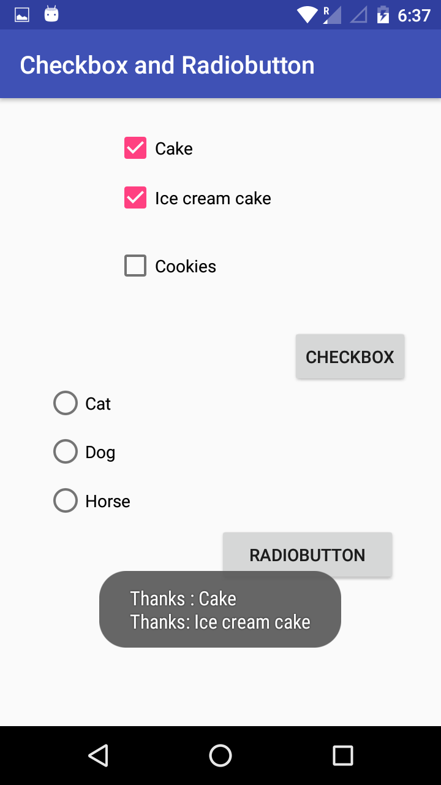
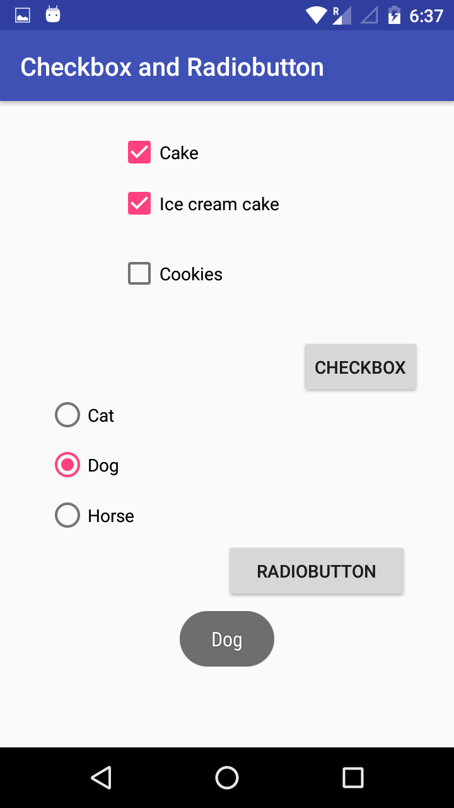
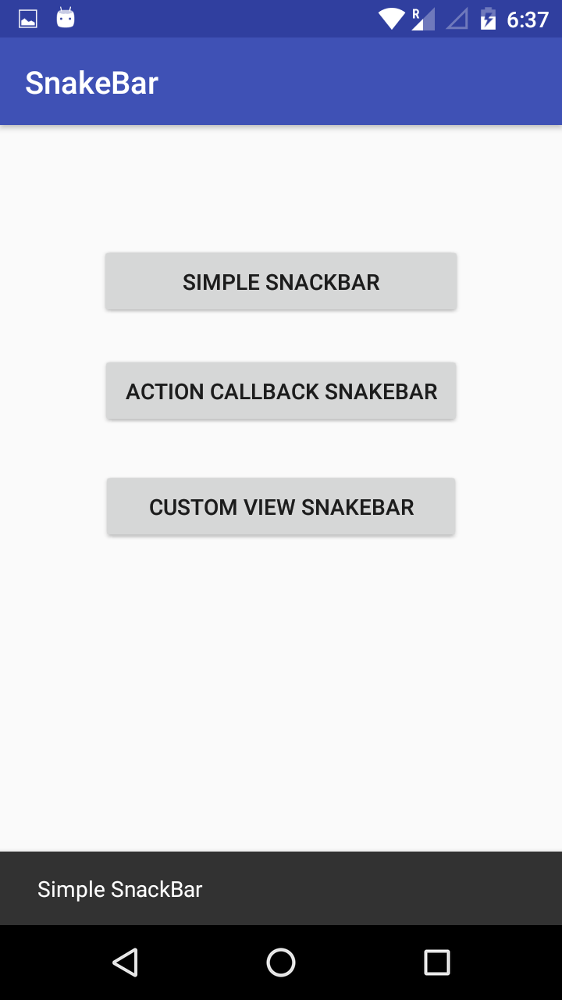
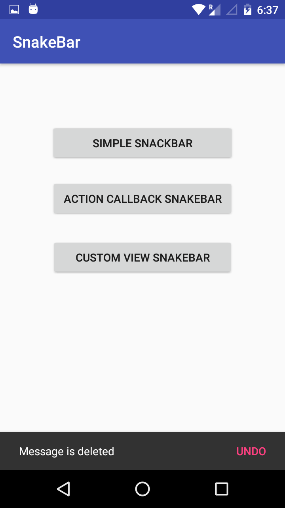
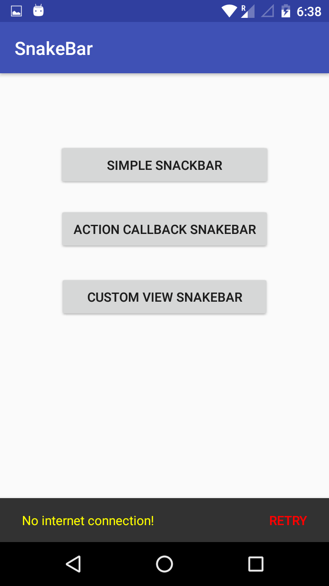

# Common Components in Android.

This app show's how to use common compounds of android Like:- 

1) Switch button. 
2) Toggle button. 
3) Seekbar.
4) Image button.
5) SnakeBar.
6) CheckBox.
7) Group Radio button.

## Screenshot:-

 

 

 

